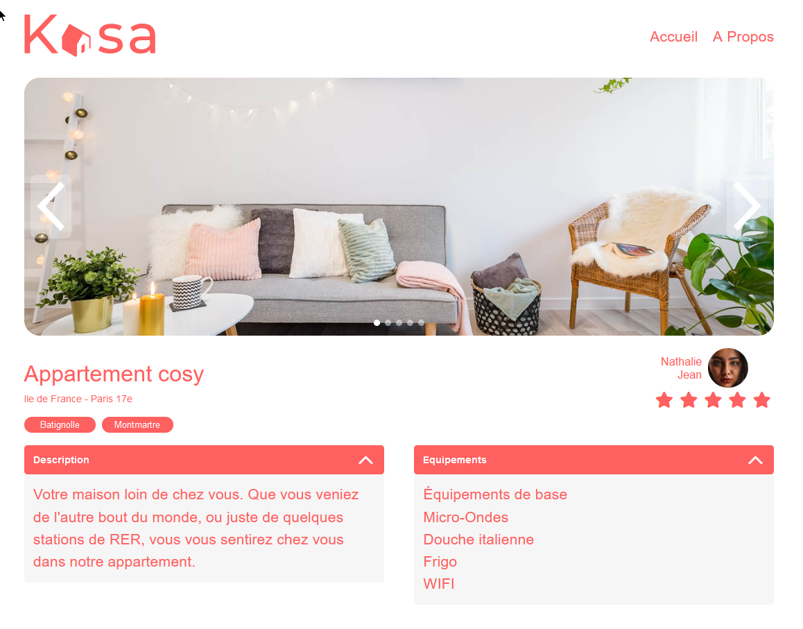

# KASA

## Projet 7 du parcours Développeur Web d'Openclassrooms.

Le client, la marque Kasa vous recrute en tant que développeur front-end en freelance pour développer sa nouvelle plateforme web

## Objectifs

- Démarrer le projet React
- Développer l’ensemble de l’application
- Développer les composants React
- Développer les routes React Router
- Suivre les maquettes Figma

## Front

- Cloner le repo
- Ouvrir le terminal dans le dossier du projet et exécuter `npm install` pour installer les dépendances.
- Exécuter `npm install node-sass` pour installer sass.
- Démarrer le projet avec `npm start`.
